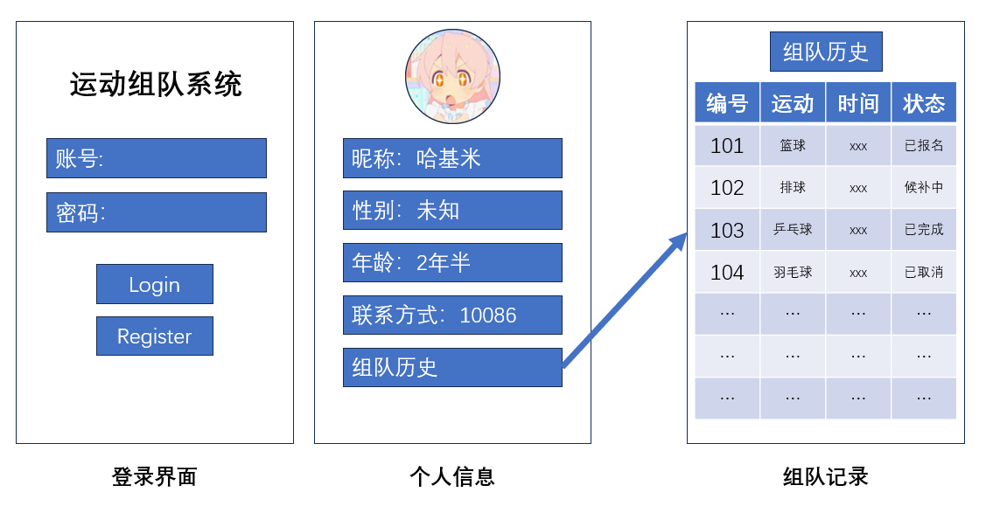
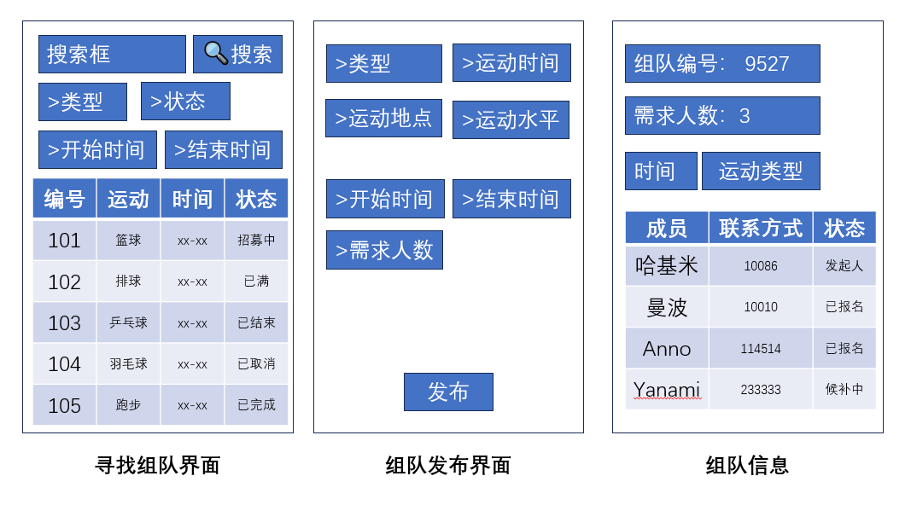

# 运动组队系统开发

## 1. 使用工具

- #### 前端：HTML、CSS、JavaScript、vue3

- #### 后端：java（Spring Boot）

- #### 数据库管理：MySQL Workbench

## 2. 需求分析

- #### 用户登录及验证、个人信息

- #### 发布组队信息界面，包含运动类型、时间地点、水平、需求人数等字段

- #### 有组队界面，包含组队信息列表。

- #### 删除、添加、修改组队列表。

- #### 支持组队的报名，报名后要能更新已报名人数、查看报名名单等。

## 3. 页面需求

<u>下划线功能</u> 代表优先度较低，推迟完成。

加粗功能 代表跳转页面

* 欢迎页面
  * 标题文字/logo
  * **登录按钮**
  * **注册按钮**
  * 说明文字
* 登录界面
  * 账号/密码输入框
  * **登录按钮**
  * **<u>找回密码按钮</u>**
* 注册界面
  * <u>邮箱地址输入框</u>
  * 账号输入框
  * 密码输入框
  * 确认密码输入框
  * <u>上传头像</u>
  * 昵称输入框
  * 性别输入框
  * 生日输入框
  * 联系方式输入框
  * 注册按钮
* 主界面
  * 个人主页
    * 显示用户信息
    * 编辑信息功能
    * <u>上传头像功能</u>
    * 历史组队信息-->组队详情页
  * 组队页面
    * 搜索框
    * 筛选框（若干）
    * 组队信息列表-->组队详情页
  * 发起组队
    * 筛选框（若干）
    * 文本框（若干）
    * 发布按钮
  * 组队详情页
    * 展示组队信息
    * 成员状态列表
    * 退出/报名按钮

效果示例：






## 4. 数据库设计


### 	1. 关系模式

* ##### 表结构：`t_user`

  * `t_user`:表名
  * `uid`: 用户唯一标识，主键，自动递增。

  - `password`: 用户密码，字符串类型，不能为空。

  - `nickname`: 用户昵称，字符串类型，不能为空。

  - `sex`: 用户性别，枚举类型（`Male`、`Female`、`Other`），不能为空。

  - `birthday`: 用户生日，日期类型。

  - `phone`: 用户手机号，字符串类型，唯一。
  - `avatar`: 用户头像路径，字符串类型，允许为空。

* ##### 说明

  1. **主键**：`uid` 是主键，自动递增。
  2. **性别**：`sex` 使用枚举类型，限制性别只能是 `Male`、`Female` 或 `Other`。
  3. **手机号**：`phone` 使用 `VARCHAR(15)`，并设置为唯一约束，确保手机号不会重复。
  4. **生日**：`birthday` 使用 `DATE` 类型，用于存储日期。

```sql
CREATE TABLE `t_user` (
    `uid` INT AUTO_INCREMENT PRIMARY KEY, -- 用户唯一标识
    `password` VARCHAR(255) NOT NULL,     -- 用户密码
    `nickname` VARCHAR(255) NOT NULL,     -- 用户昵称
    `sex` ENUM('Male', 'Female', 'Other') NOT NULL, -- 用户性别
    `birthday` DATE,                      -- 用户生日
    `phone` VARCHAR(15) UNIQUE,           -- 用户手机号
    `avatar` VARCHAR(255)                 -- 用户头像路径
);
```


* ##### 表结构：`sportname`

  - `sid`: 运动项目的唯一标识，主键，自动递增。
  - `sname`: 运动项目的名称，字符串类型，不能为空。
  - `stype`: 运动项目的类型，字符串类型，不能为空。

* **说明**

  * **主键**：`sid` 是主键，自动递增。
  * **运动项目名称**：`sname` 使用 `VARCHAR(255)`，不能为空。
  * **运动项目类型**：`stype` 使用 `VARCHAR(255)`，不能为空。

```sql
CREATE TABLE `sportname` (
    `sid` INT AUTO_INCREMENT PRIMARY KEY, -- 运动项目唯一标识
    `sname` VARCHAR(255) NOT NULL,       -- 运动项目名称
    `stype` VARCHAR(255) NOT NULL        -- 运动项目类型
);
```


* ##### 表结构：`teaminfo`

  - `tid`: 队伍的唯一标识，主键，自动递增。
  - `sid`: 运动id，必须是 `sid`，外键关联到 `t_sportname` 表的 `sid` 列。
  - `sponsor`: 发起人，必须是 `uid`，外键关联到 `t_user` 表的 `uid` 列。
  - `level`: 队伍水平，整数类型。
  - `already`: 已报名人数，整数类型。
  - `need`: 需要的人数，整数类型。
  - `tstatus`: 队伍状态，整数类型。
  - `runtime`: 运动时间，日期时间类型。
  - `starttime`: 开始时间，日期时间类型。
  - `endtime`: 结束时间，日期时间类型。

* ##### 说明：

  1. **主键**：`tid` 是主键，自动递增。
  2. **外键**：`sponsor` 是外键，关联到 `t_user` 表的 `uid` 列。这确保了 `sponsor` 的值必须是有效的用户 ID。
  3. **时间字段**：`runtime`、`starttime` 和 `endtime` 使用 `DATETIME` 类型，用于存储日期和时间。
  4. **整数字段**：`level`、`already`、`need` 和 `status` 使用 `INT` 类型，用于存储整数值。

```sql
CREATE TABLE `teaminfo` (
    `tid` INT AUTO_INCREMENT PRIMARY KEY, -- 队伍唯一标识
    `sponsor` INT NOT NULL,               -- 发起人，必须是 `uid`
    `level` INT,                          -- 队伍水平：1-5由低到高
    `already` INT,                        -- 已报名人数
    `need` INT,                           -- 需要的人数
    `tstatus` INT,                         -- 队伍状态 1：招募中 2：已取消 3：已结束
    `runtime` DATETIME,                   -- 运动时间
    `starttime` DATETIME,                 -- 开始时间
    `endtime` DATETIME,                   -- 结束时间
    FOREIGN KEY (`sponsor`) REFERENCES `t_user`(`uid`) -- 外键关联到 `t_user` 表的 `uid` 列
);

-- 添加 sid 列
ALTER TABLE `t_teaminfo`
ADD COLUMN `sid` INT NOT NULL;

-- 添加外键约束
ALTER TABLE `t_teaminfo`
ADD CONSTRAINT `fk_t_teaminfo_sid`
FOREIGN KEY (`sid`) REFERENCES `t_sportname` (`sid`);
```


* ##### 表结构：`t_teammember`

  - `uid`: 用户的唯一标识，外键关联到 `t_user` 表的 `uid` 列。
  - `tid`: 队伍的唯一标识，外键关联到 `t_teaminfo` 表的 `tid` 列。
  - `sid`: 运动项目的唯一标识，外键关联到 `t_sport` 表的 `sid` 列。
  - `mstatus`: 成员状态，整数类型。

* ##### 说明：

  1. **主键**：使用复合主键 `(uid, tid, sid)`，确保每个用户在每个队伍中只能参与一个运动项目。
  2. **外键**：
     - `uid` 关联到 `t_user` 表的 `uid` 列。
     - `tid` 关联到 `t_teaminfo` 表的 `tid` 列。
     - `sid` 关联到 `t_sport` 表的 `sid` 列。
  3. **成员状态**：`mstatus` 使用 `INT` 类型，用于存储成员的状态。

```sql
CREATE TABLE `t_teammember` (
    `uid` INT NOT NULL, -- 用户的唯一标识
    `tid` INT NOT NULL, -- 队伍的唯一标识
    `sid` INT NOT NULL, -- 运动项目的唯一标识
    `mstatus` INT,      -- 成员状态 1.已报名 2.已取消 3.已结束
    PRIMARY KEY (`uid`, `tid`, `sid`), -- 复合主键
    FOREIGN KEY (`uid`) REFERENCES `t_user`(`uid`), -- 外键关联到 t_user 表
    FOREIGN KEY (`tid`) REFERENCES `t_teaminfo`(`tid`), -- 外键关联到 t_teaminfo 表
    FOREIGN KEY (`sid`) REFERENCES `t_sportname`(`sid`) -- 外键关联到 t_sport 表
);
```

### 2. 视图

- 个人信息视图
  - uid、nickname、sex、birthday、phone、avatar
- 历史组队视图
  - tid、sname、tstatus、mstatus、runtime
- 组队成员视图
  - tid、nickname、mstatus
- 组队界面视图
  - tid、sname、sponsor、level、already、need、tstaus、runtime、startime、endtime

### 3. event

#### **自动更新 `tstatus`**组队状态（endtime后结束）

这个事件会在当前时间超过 `endtime` 时，将 `t_teaminfo` 表中的 `tstatus` 设置为 3。

```sql
DELIMITER //

CREATE EVENT IF NOT EXISTS update_tstatus_event
ON SCHEDULE EVERY 1 MINUTE
DO
BEGIN
    UPDATE t_teaminfo
    SET tstatus = 3
    WHERE tstatus != 3 AND endtime < NOW();
END //

DELIMITER ;
```

#### **自动更新更新 `mstatus`**成员状态（runtime后结束）

这个事件会在当前时间超过 `runtime` 时，将 `t_teammember` 表中的 `mstatus` 设置为 3。

```sql
DELIMITER //

CREATE EVENT IF NOT EXISTS update_mstatus_event
ON SCHEDULE EVERY 1 MINUTE
DO
BEGIN
    UPDATE t_teammember tm
    JOIN t_teaminfo ti ON tm.tid = ti.tid
    SET tm.mstatus = 3
    WHERE tm.mstatus != 3 AND ti.runtime < NOW();
END //

DELIMITER ;
```

#### **说明**

1. **`ON SCHEDULE EVERY 1 MINUTE`**：
   - 这两个事件每分钟检查一次。你可以根据实际需求调整检查频率，例如每 5 分钟或每 10 分钟检查一次。
   - 如果你希望更频繁地检查，可以将时间间隔设置得更短，但请注意数据库的性能。
2. **`WHERE` 条件**：
   - 在更新 `tstatus` 时，`endtime < NOW()` 确保只有当当前时间超过 `endtime` 时才会更新。
   - 在更新 `mstatus` 时，`ti.runtime < NOW()` 确保只有当当前时间超过 `runtime` 时才会更新。
   - `tstatus != 3` 和 `mstatus != 3` 确保不会重复更新已经设置为 3 的记录。
3. **`JOIN` 操作**：
   - 在更新 `mstatus` 时，通过 `JOIN` 将 `t_teammember` 表与 `t_teaminfo` 表连接，以便根据 `runtime` 字段进行更新。

#### **启用事件调度器**

在 MySQL 中，默认情况下事件调度器是禁用的。你需要手动启用它：

```sql
SET GLOBAL event_scheduler = ON;
```

### 4.触发器

#### 检查是否满员

```sql
DELIMITER //
CREATE TRIGGER update_teaminfo_status
BEFORE UPDATE ON t_teaminfo
FOR EACH ROW
BEGIN
    -- 检查already或need是否发生变化
    IF (NEW.already <> OLD.already OR NEW.need <> OLD.need) THEN
        -- 根据新值比较设置tstatus
        IF (NEW.already >= NEW.need) THEN
            SET NEW.tstatus = 4;
        ELSE
            SET NEW.tstatus = 1;
        END IF;
    END IF;
END;
//
DELIMITER ;
```


## 5. 后端业务

mapper层：操作数据库

service层：处理业务

controller层：提供接口与前端交互

entity层：实体类

- 发起人发起组队（插入t_teaminfo表）时，在teammember插入对应数据，mstatus设为1'

- t_teammember插入新数据时，tid对应的teaminfo表already+1
- t_teammember更新mstatus时，如果mstatus从1变为2，tid对应的teaminfo表already-1
  
- sponsor解散队伍时，成员mstatus变为4
  
- 不在报名时间内无法报名


## 6. 接口

* **用户信息（root）**
  * /root/user/findAll
  * 参数：null
  * 返回：List\<User>
* **注册用户（root）**
  * /root/user/insertUser 
  * 参数：(@RequestBody User user)
  * 返回：string信息
* **删除用户（root）**
  * /root/user/deleteUser/{id}  
  * 参数：(@PathVariable int id)
  * 返回：string信息
* **更新用户（root）**
  * /root/user/updateUser/{id}
  * 参数：(@PathVariable int id)
  * 返回：string信息
* **查找运动**
  * /sport/findAll
  * 参数：null
  * 返回：List\<Sport>
* **插入运动（root）**
  * /root/sport/insert
  * 参数：(@RequestBody Sport sport)
  * 返回：string信息
* **根据uid查找组队信息（找队伍）**
  * /member/uid/{uid}
  * 参数：(@PathVariable int uid)
  * 返回：List\<Team>
* **根据tid查找组队信息（找成员）**
  * /member/tid/{tid}
  * 参数：(@PathVariable int tid)
  * 返回：List\<Member>
* **插入新的成员信息（报名）**
  * /member/insert
  * 参数：(@RequestBody Member member)
  * 返回：string信息
* **获取所有组队记录（视图)**
  *  /history/findAll
  * 参数：null
  * 返回：List\<TeamHistory>
* **根据uid获取历史组队记录（视图）**
  * /history/findById/{uid}
  * 参数：(@PathVariable int uid)
  * 返回：List\<TeamHistory>
* **根据tid获取队伍成员（视图）**
  * /findTeamMember/{tid}
  * 参数：(@PathVariable int tid)
  * 返回：List\<TeamMember>
* **根据uid获取用户信息（视图）**
  *  /userInfo/{uid}
  * 参数：(@PathVariable int uid)
  * 返回：UserInfo
* **查找当前正在招募的组队信息（视图）**
  * /runningTeam
  * 参数：null
  * 返回：List\<TeamInfo>

## 7. 实体类

```java
@TableName("t_user")
public class User {

    @TableId(type = com.baomidou.mybatisplus.annotation.IdType.AUTO)
    private Integer uid;

    @TableField("password")
    private String password;

    @TableField("nickname")
    private String nickname;

    @TableField("sex")
    private Sex sex;

    @TableField("birthday")
    private LocalDate birthday;

    @TableField("phone")
    private String phone;

    @TableField("avatar")
    private String avatar;

    // 枚举类型 Sex
    public enum Sex {
        Male,
        Female,
        Other
    }
}
```

```java
@TableName("t_sportname")
public class Sport {

    @TableId(type = com.baomidou.mybatisplus.annotation.IdType.AUTO)
    private Integer sid;

    @TableField("sname")
    private String sname;

    @TableField("stype")
    private String stype;
}
```

```java
@TableName("t_teaminfo")
public class Team {
    @TableId(type = com.baomidou.mybatisplus.annotation.IdType.AUTO)
    private Integer tid; // 任务ID

    @TableField("sid")
    private Integer sid; // 用户ID

    @TableField("sponsor")
    private Integer sponsor; // 发起人ID

    @TableField("level")
    private Integer level; // 任务级别

    @TableField("already")
    private Integer already; // 已完成数量

    @TableField("need")
    private Integer need; // 需要数量

    @TableField("tstatus")
    private Integer tstatus; // 任务状态

    @TableField("runtime")
    private LocalDate runtime; // 运行时间

    @TableField("starttime")
    private LocalDate starttime; // 开始时间

    @TableField("endtime")
    private LocalDate endtime; // 结束时间
}
```

```java
@TableName("t_teammember")
public class Member {

    @TableField("uid")
    private Integer uid;

    @TableField("tid")
    private Integer tid;

    @TableField("mstatus")
    private Integer mstatus;
}
```

```java
@TableName("v_teamhistory")
public class TeamHistory {
    private Integer uid; // 用户ID
    private Integer tstatus; // 团队状态
    private Integer tid; // 团队ID
    private String sname; // 运动名称
    private LocalDateTime runtime; // 时间戳
    private Integer mstatus; // 成员状态
}
```

```java
@TableName("v_teaminfo")
public class TeamInfo {

    @TableId()
    private Integer tid; // 组队ID

    @TableField("sname")
    private String sname; // 运动名称

    @TableField("sponsor")
    private String sponsor; // 发起人昵称

    @TableField("level")
    private Integer level; // 任务级别

    @TableField("already")
    private Integer already; // 已完成数量

    @TableField("need")
    private Integer need; // 需要数量

    @TableField("tstatus")
    private Integer tstatus; // 任务状态

    @TableField("runtime")
    private LocalDate runtime; // 运行时间

    @TableField("starttime")
    private LocalDate starttime; // 开始时间

    @TableField("endtime")
    private LocalDate endtime; // 结束时间
}
```

```java
@TableName("v_userinfo")
public class UseInfo {

    @TableId()
    private Integer uid;

    @TableField("sex")
    private User.Sex sex;

    @TableField("birthday")
    private LocalDate birthday;

    @TableField("phone")
    private String phone;

    @TableField("avatar")
    private String avatar;

    // 枚举类型 Sex
    public enum Sex {
        Male,
        Female,
        Other
    }
}
```

```java
@TableName("v_teammember")
public class TeamMember {

    @TableId
    private Integer tid;

    @TableField("nickname")
    private String nickname;

    @TableField("mstatus")
    private Integer mstatus;
}
```


创建vue3项目:
npm create vue@latest sportteamsys -- --template vue
cd sportteamsys
npm install

安装element-plus：
npm install element-plus --save

运行项目：
npm run dev


mstatus：

1：已报名

2：已退出

3：已完成

4：已解散

5：发起者

tstatus

1：招募中

2：已解散

3：已完成

4：已满员


## 8.前端

### 已完成

- 主页，登录，注册界面及其功能
- 登录状态保存、安全退出
- 个人信息
- 寻找组队页面
- 发起组队页面
- 历史组队页面

### 待完成：

- 组队详情页
- 排序机制优化
- 个人信息修改
- 报名、取消、解散队伍
- 

